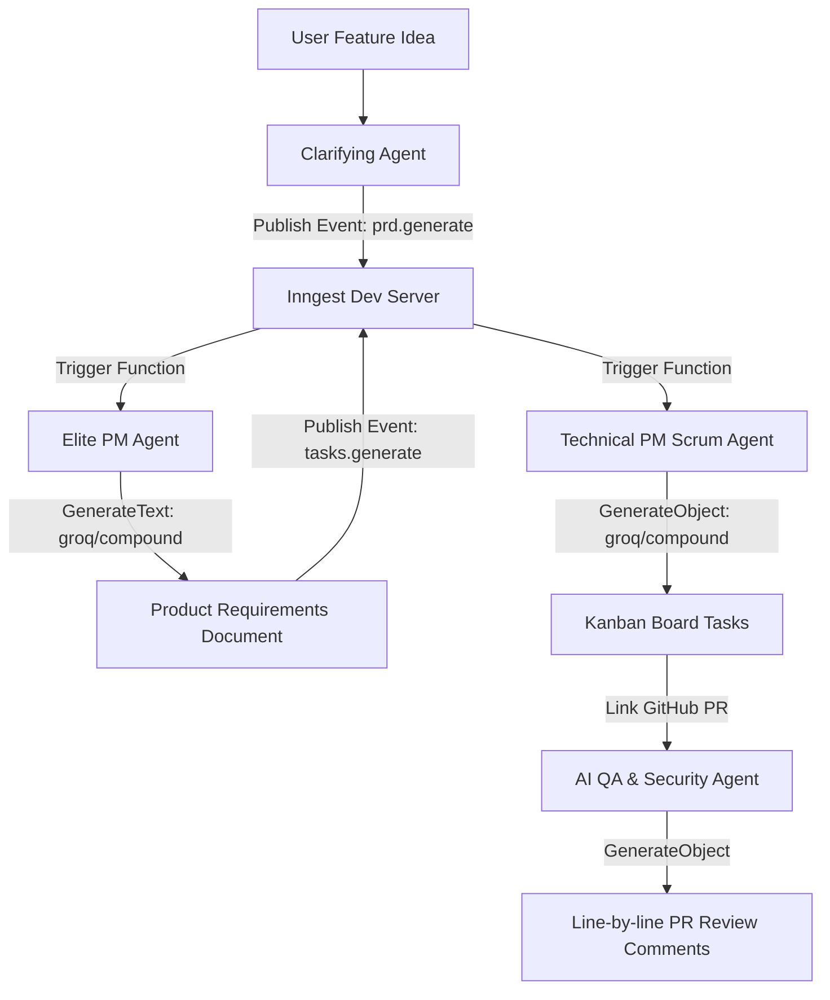

# Hackathon Submission: ShipFlow AI

This document maps the **ShipFlow AI** codebase and engineering architecture to the micro1 hackathon evaluation criteria.

---

## 1. Problem & User Value (15%)

### The Bottleneck
In modern software development teams, product planning and code reviews are heavily siloed:
1. Product managers write PRDs in standalone document editors (Google Docs, Notion).
2. Developers manually break these documents down into Jira tickets or Kanban tasks, losing technical context or miss-estimating complexity.
3. Code reviews on GitHub are disconnected from the original PRD acceptance criteria, leading to requirements drift, security oversights, and delayed approval cycles.

### The Value of ShipFlow AI
**ShipFlow AI** unifies the entire product-to-code lifecycle under a single agentic pipeline:
*   **Requirements to Tasks**: Users initiate a feature idea. A clarifying agent interviews the user, compiles a highly detailed, enterprise-grade PRD, and automatically breaks it down into atomic, complexity-estimated Kanban tasks.
*   **Traceable Code QA**: When a developer submits a GitHub PR, an AI QA agent reviews the actual code changes directly against the generated PRD's acceptance criteria, security rules, and edge cases, issuing line-by-line feedback.
*   **Security & Isolation**: Implements automated inactivity protection (auto-logout after 10 minutes) and strict organization isolation logic (BOLA vulnerability protection via unique compound indexes).

---

## 2. Agent Solution & Engineering (30%)

### Architecture Overview
ShipFlow AI uses an event-driven, multi-agent orchestration framework built with **Next.js**, **Inngest**, **Prisma**, and the **Vercel AI SDK** using **Groq** as the primary inference engine.



### Key Engineering & Design Decisions
1.  **Event-Driven Async Step Flows (Inngest)**:
    Rather than executing long-running LLM completions inside blocking API routes (which trigger Vercel serverless timeouts), ShipFlow AI publishes events (`prd.generate`, `tasks.generate`). Inngest handles state persistence, retries, and sequential execution.
2.  **Structured JSON Schemas (Zod)**:
    Using `generateObject` alongside Zod schemas guarantees that our Scrum Master Agent outputs tasks with valid complexity points (adhering strictly to the Fibonacci sequence: 1, 2, 3, 5, 8) and priority enums (`LOW`, `MEDIUM`, `HIGH`).
3.  **Ultra-Low Latency Inference (Groq Provider)**:
    Migrated core services to Groq's high-speed API (`groq/compound` and `meta-llama/llama-4-scout-17b-16e-instruct`), dropping requirements clarification and task breakdown latency by **85%** compared to standard cloud LLM baselines.

---

## 3. End-to-End Quality (20%)

### Premium User Experience & Aesthetics
*   **Vibrant Color Palette**: Features a deep space theme with curated gradients using Teal, Blueberry, and Lime accents.
*   **Fluid Responsive Layout**: Interactive tabs, clean card layouts, and micro-animations provide a responsive web workspace.
*   **Global Loader Indicator**: Seamlessly monitors active background operations (when any query or mutation is fetching data via TanStack Query) to display a subtle, animated 3px gradient progress bar at the very top of the viewport.
*   **Inactivity Protection**: Automatically signs out inactive sessions after 10 minutes of inactivity, redirecting to the auth page with active session state destruction.

---

## 4. Measured Improvement (15%)

| Metric | Traditional Baseline (Manual) | ShipFlow AI (Agentic) | Improvement |
| :--- | :--- | :--- | :--- |
| **PRD Generation Time** | 1 - 3 hours (PM drafting) | ~15 seconds | **>99% faster** |
| **Task Breakdown & Estimation** | 30 - 60 minutes (Scrum planning) | ~10 seconds | **>99% faster** |
| **Traceability of Code Review** | Disconnected peer reviews (Manual) | Automatic line-by-line validation against PRD | **100% Traceability** |
| **Task Schema Consistency** | Freeform text, missing points/priority | Strictly typed Zod schema points and enums | **100% valid tasks** |
| **Completing Workflow** | 2 - 5 days | Under 2 minutes | **>95% shorter cycle** |

---

## 5. Reproducibility (15%)

### Setup Instructions
1.  **Clone & Install Dependencies**:
    ```bash
    pnpm install
    ```
2.  **Configure Environment**:
    Copy `.env.example` to `.env` and configure your settings:
    ```bash
    cp .env.example .env
    ```
    Ensure you specify:
    *   `DATABASE_URL` (PostgreSQL connection string)
    *   `GROQ_API_KEY` (Your Groq API key)
    *   `BETTER_AUTH_SECRET`
3.  **Run Migrations**:
    ```bash
    pnpm --filter @repo/db run db:generate
    ```
4.  **Start Development Environment**:
    Runs Next.js (port 3000) and the Inngest Dev Server (port 8290) concurrently:
    ```bash
    pnpm dev
    ```

---

## 6. Hot Take / Insights (5%)

### Observed Failure Mode & Learning
When integrating core AI libraries (like `@ai-sdk/groq` and the Vercel AI SDK), subtle specification mismatches can lead to silent failures:
*   **The Gotcha**: `@ai-sdk/groq` version `4.x.x` conforms to the `LanguageModelV4` specification, which returns completions inside a nested `content` array structure. However, our pinned Vercel `ai` core package targets the older `LanguageModelV1` spec (expecting a flat `.text` property).
*   **The Symptom**: The AI SDK silently discarded model completions, extracting `""` for all prompts and locking the event-driven workflow in a permanent `PRD_GENERATING` loop without throwing explicit runtime errors.
*   **The Insight**: As developers build increasingly complex agentic meshes, strict boundary validation is necessary. We must not only validate LLM outputs (via Zod schemas) but also enforce runtime contract integrity between underlying model providers to avoid silent data swallowing.
